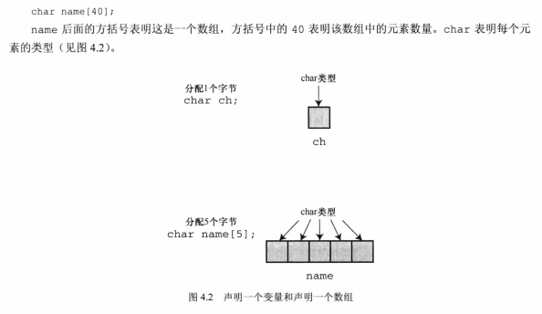

# 04 字符串和输入输出格式化

## 4.1 本章的第一个代码示例

```c
//该程序演示与用户的交互
#include <stdio.h>
#include <string.h> //strlen()函数的原型
#define DENSITY 62.4 // 人体密度（单位：磅/立方英尺）
int main (void)

{
    float weight ,volume;
    int size ,letters;
    char name [40];//name是可以容纳40个字符的数组。

    printf("HI! What's your first name ?\n");
    scanf ("%s",name);//数组变量不需要&。
    printf("%s, what's your weight in pounds? \n",name);
    scanf("%f",&weight);
    size= sizeof name ;
    letters=strlen(name);
    volume=weight/DENSITY;

    printf("Well, %s ,your volume is %2.f cubic feet.\n",
            name, volume);

    printf("Also ,your first name has %d lerrers,\n",
            letters);

    printf("and we have %d  bytes to store it .\n",
            size);

    return 0;
}
```

* **char name [40];**

  该案例中，用于存储字符串。在该程序中，用户输入的名被存储在数组中，该数组占用内存中的40个字节。每个字节存储一个字符值。

* **%s**

  用于处理字符串的输入和输出。

* **scanf（）与&**

  普通变量需要加&；数组变量不需要加&。

* **#define DENSITY 62.4** 

  字符常量，C语言中常量的定义方式。

* **strlen(name)**

  获取字符串的长度。

## 4.2 字符串简介

* 字符串：

  是一个或多个字符的序列。“XXXXXXXXXX”;双引号仅告知编译器它括起来的是字符串。是一个定界符。

* char 类型：

  在c语言中，字符串都被存储在char类型的数组中。

  空字符：

  空字符不是“0”，而是'\0'。即null character，是非打印字符，对应的ACSII值为0。C的字符串一定以空字符结束；这意味着，程序员在编程时，需要将定义的数组容量必须比待存储的字符串的字符多1。

  数组：

  是同类型的数据元素的有序序列。

  


* 使用字符串

```c
#include <stdio.h>

#define PRAISE "you are an extraordinary being."

int main(void)
{
    char name [40];
    printf("What is your name?\n");
    scanf("%s",name);
    printf("Hello, %s .%s \n",name ,PRAISE);
    
    return 0;
}
```


